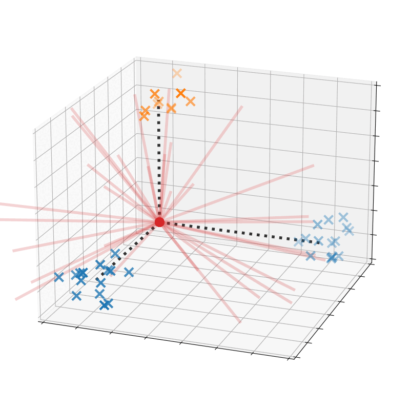
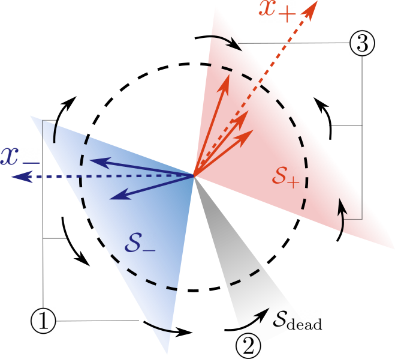
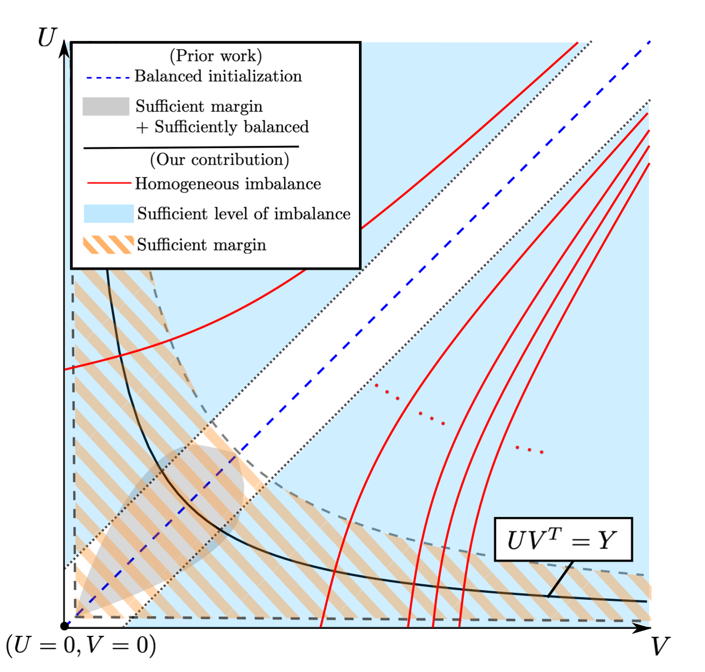
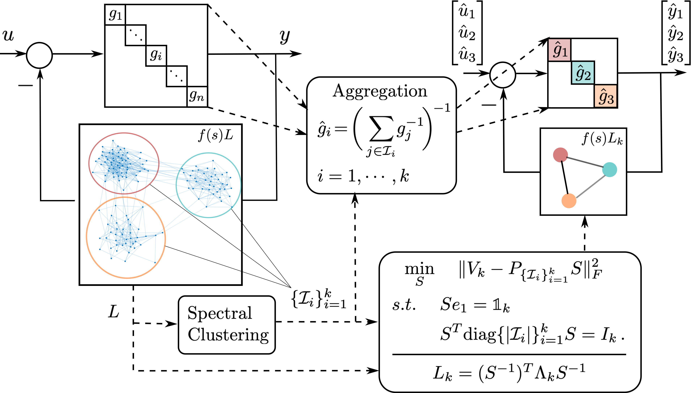
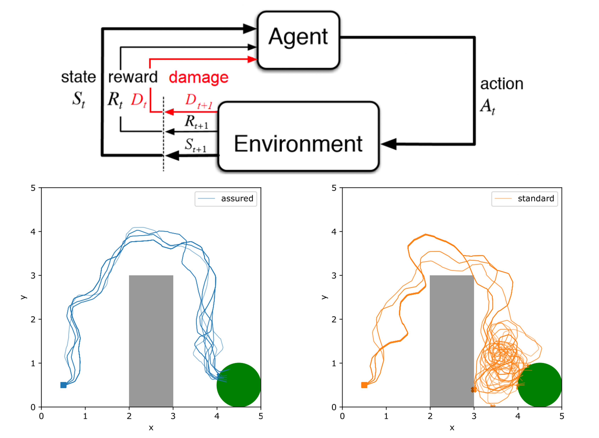

<!-- pages/projects.md -->

  <h2 class="category">Ongoing</h2>
  

  

    <i>Understanding Adversarial Robustness from an Implicit Bias Perspective</i>
  

     
    <!--Image container start-->
    

        
    

    <!--Image container end-->
    <!--Text container start-->
    

        Deep classifiers are notoriously vulnerable to <b>adversarial attacks</b> — small, imperceptible input perturbations that flip the prediction. While most defenses add explicit mechanisms or adversarial examples to the training procedure, our work asks a different question: <b>can the implicit bias of standard gradient-based training itself favor robust classifiers?</b> We study this for shallow (two-layer) ReLU networks trained by gradient flow from small initialization, where data come from a mixture of sub-Gaussian clusters grouped into classes. Building on our neuron-alignment analysis, we show that the standard ReLU activation causes neurons to align only with the <i>average</i> class centers, yielding a classifier that generalizes well on clean data but is provably non-robust to small attacks — a neural-alignment explanation of the non-robustness identified by prior work. Crucially, replacing ReLU with a <b>polynomial ReLU (pReLU)</b> activation alters the implicit bias so that neurons instead align with the individual <i>subclass</i> centers, yielding a classifier that is both accurate and robust to constant-radius attacks. We further formalize this for orthonormal Gaussian mixture data by characterizing the <b>maximum attack radius</b> any classifier can withstand and proving that gradient flow on a pReLU network, without any adversarial examples, provably learns a classifier attaining this optimal robustness. Together, these results highlight that adversarial robustness can be achieved through the interplay of <b>data geometry</b> and <b>architecture design</b> rather than defense mechanisms.

         
         

        <u>Related work</u>

        <ul>
          <li></li>
          <li></li>
        </ul>

         

    

  <!--Text container end-->
  

  

  

    <i>Neural Alignment in Shallow Networks with Small Initialization</i>
  

     
    <!--Image container start-->
    

        
    

    <!--Image container end-->
    <!--Text container start-->
    

        Many theoretical studies attribute the excellent empirical performance of neural networks to the <b>implicit bias</b> induced by first-order algorithms when training overparametrized networks from <b>small initialization</b>. A central thread of our work studies how this bias shapes the <b>directions of neurons</b> in a two-layer ReLU network trained by gradient flow. We consider data that are well-separated in the sense that same-label inputs are positively correlated and different-label inputs are negatively correlated. Our analysis reveals a two-phase learning dynamics: in the early <b>alignment phase</b>, first-layer neurons rapidly align with the class (or subclass) centers of the data — a phenomenon whose timescale we bound explicitly in terms of the number of samples and how well they are separated — after which the loss decays and the first-layer weight matrix becomes approximately low-rank. This alignment mechanism has proven to be a versatile lens: it explains how <b>Neural Collapse</b> emerges from the training dynamics rather than from an unconstrained-feature landscape, and it extends to the learning dynamics of <b>Low-Rank Adaptation (LoRA)</b>, where an analogous alignment phase orients the singular vectors of the LoRA weights to correct the misalignment between the pre-trained model and the fine-tuning target. Together, these results show that the implicit bias of gradient flow under small initialization drives a shared alignment-and-convergence geometry across shallow networks, Neural Collapse, and LoRA.

         
         

        <u>Related work</u>

        <ul>
          <li></li>
          <li></li>
          <li></li>
        </ul>

         

    

  <!--Text container end-->
  

  

  

    <i>Convergence and Implicit Bias of Overparametrized Neural Networks</i>
  

     
    <!--Image container start-->
    

        
    

    <!--Image container end-->
    <!--Text container start-->
    

        Neural networks trained via gradient descent with random initialization and without any regularization enjoy good generalization performance in practice despite being <b>highly overparametrized</b>. A promising direction to explain this phenomenon is to study how <b>initialization</b> and overparametrization affect the <b>convergence</b> and <b>implicit bias</b> of training algorithms. We present a novel analysis of the convergence and implicit bias of gradient flow for linear networks, which connects initialization, optimization, and overparametrization. Our results show that sufficiently overparametrized linear networks are guaranteed to converge to the min-norm solution when properly initialized. Moreover, our convergence analysis is generalized to deep linear networks under a general loss function.

         
         

        <u>Related work</u>

        <ul>
          <li></li>
          <li></li>
          <li></li>
          <li></li>
        </ul>

         

    

  <!--Text container end-->
  

  <h2 class="category">Past</h2>

  

  

    <i>Learning Coherent Clusters in Large-scale Network Systems</i>
  

   
    <!--Image container start-->
    

        
    

    <!--Image container end-->
    <!--Text container start-->
    

        <b>Coherence</b> refers to the ability of a group of interconnected dynamical nodes to respond similarly when subject to certain disturbances. Coherence is instrumental in understanding the collective behavior of large networks, including consensus networks, transportation networks, and power networks. We developed a novel <b>frequency-domain analysis</b> for understanding network coherence, showing that coherent behavior corresponds to the network transfer matrix being approximately low rank in the frequency domain, and it emerges as the network connectivity increases. Such an analysis encompasses heterogeneous node dynamics and leads to a theoretically justifiable aggregation model for a coherent group especially suitable for application to power networks. Moreover, combining our coherence analysis with spectral clustering techniques leads to a novel <b>structure-preserving reduction</b> for large-scale networks with multiple weakly-connected coherent subnetworks, which models the interaction among coherent groups in a highly <b>interpretable</b> manner and opens new avenues for scalable control designs that leverage the reduced network model.

         
         

        <u>Related work</u>

        <ul>
          <li></li>
          <li></li>
          <li></li>
          <li></li>
          <li></li>
        </ul>

         

  

  <!--Text container end-->
  

  

  

    <i>Safe Reinforcement Learnining with Almost Sure Constraints</i>
  

   
    <!--Image container start-->
    

        
    

    <!--Image container end-->
    <!--Text container start-->
    

          A vast body of work has been developing model-free constraint reinforcement learning algorithms that can implement highly complex actions for <b>safety-critical</b> autonomous systems, such as self-driving cars, robots, etc. However, constraints in most existing work are probabilistic (either in expectation or with high probability), which does not allow for settings with hard constraints that need to be satisfied with probability one. In practice, however, failing to satisfy the safety constraints with a non-zero probability could result in some catastrophic events (a car crash, in the example of self-driving cars). Weighing safety much more than system performance, we work on a new formulation of constrained reinforcement learning problems that better respects the operational constraints in safety-critical systems. Unlike standard approaches that encode the safety requirements as some constraints on the expected value of accumulated safety-indicating signals, our formulation aims to find a policy that satisfies the safety requirements with <b>probability one</b>. Based on a separation principle between the value function for optimality and the one for safety, we develop an algorithm that finds all safe policies by learning a <b>safe barrier function</b> on all state-action pairs. Such an algorithm is much more <b>sample-efficient</b> than those trying to learn the optimal policy. The learned barrier function can be further incorporated into standard reinforcement learning algorithms such as Q-learning for learning the optimal safe policy.

         
         

        <u>Related work</u>

        <ul>
          <li></li>
          <li></li>
          <li></li>
        </ul>

         

  

  <!--Text container end-->
  

